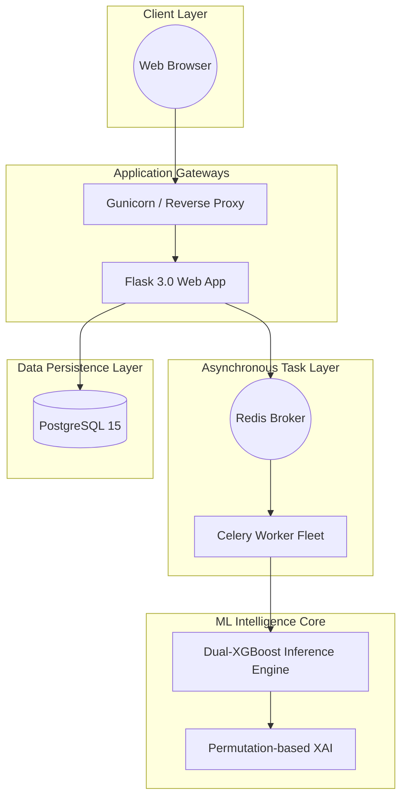
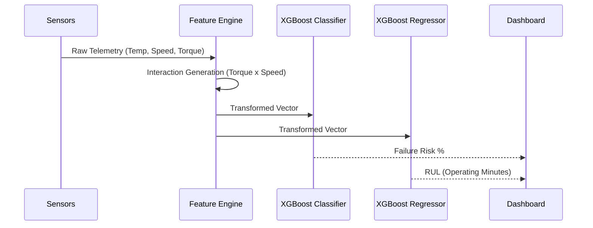

# IndustriSense AI: Enterprise Predictive Maintenance Platform

## Overview

IndustriSense AI is a **production-ready predictive maintenance platform** designed for industrial facilities. It transforms raw sensor telemetry from the AI4I 2020 dataset into actionable operational intelligence using dual XGBoost inference engines.

### Key Industrial Capabilities
- **Fleet-Wide Risk Assessment:** Real-time failure classification across thousands of assets.
- **RUL Prognosis:** Analytical estimation of Remaining Useful Life (RUL) using tool-wear proxies.
- **Enterprise Multi-Tenancy:** Secure data isolation based on corporate email domains.
- **Role-Based Access Control (RBAC):** Functional separation for Operators, Reliability Engineers, and Plant Managers.
- **Actionable Feedback:** Automatic generation of maintenance work orders based on AI risk thresholds.

---

## 🏗️ Production Architecture (Graduated)

The platform has graduated from a prototype script to a containerized industrial stack:
- **Web Engine:** Flask (Python 3.10)
- **Database:** PostgreSQL (Production-grade concurrency)
- **Task Queue:** Celery + Redis (Asynchronous background inference)
- **Orchestration:** Docker Compose

---

## 🚀 Quick Start: Docker Deployment (Recommended)

The entire industrial stack can be deployed with a single command. This handles the database setup, message brokers, and background workers automatically.

### Prerequisites
- **Docker** and **Docker Compose V2** (Standard on modern Docker Desktop/Linux installs)

### Step 1: Clone and Launch
```bash
git clone https://github.com/Trailblazer-dev/IndustriSense-AI.git
cd IndustriSense-AI
docker compose up --build -d
```

### Step 2: Access the Platform
- **Web Dashboard:** [http://localhost:5000](http://localhost:5000)
- **API Documentation:** [http://localhost:5000/models](http://localhost:5000/models)

---

## 👔 User Roles & Multi-Tenancy

IndustriSense AI uses **Domain-Based Multi-Tenancy**. Users with the same corporate email domain (e.g., `@factory-a.com`) are automatically grouped into the same Organization and share fleet visibility.

| Role | Responsibility | Key Access |
|------|----------------|------------|
| **Maintenance Operator** | Daily Floor Operations | Real-time Dashboard, Work Orders |
| **Reliability Engineer** | Technical Analysis | Advanced Analytics, XAI, Model Specs |
| **Plant Manager** | Strategic Oversight | Audit Archiving, Financial ROI Reports |
| **System Admin** | Platform Integrity | Full System Control |

*Note: The first user to register from a new domain is automatically promoted to **System Administrator**.*

---

## 🧪 Experimentation & Notebooks (Data Science)

For data scientists wishing to retrain models or explore the feature engineering pipeline:

### Local Setup
```bash
python -m venv venv
source venv/bin/activate  # or .\venv\Scripts\Activate.ps1 on Windows
pip install -r requirements.txt
jupyter notebook
```

### Analytical Pipeline
Navigate to `notebooks/` to explore:
1. **1_EDA.ipynb:** Dataset distribution and outlier analysis.
2. **2_Feature_Engineering.ipynb:** Derivation of Stress Index and Thermal Differentials.
3. **3_Failure_Classification:** XGBoost training for TWF, HDF, PWF, OSF.
4. **4_RUL_Prognosis:** Regressor training for tool-wear estimation.
5. **5_XAI:** Permutation-based interpretation of failure drivers.

## 🏗️ Technical Architecture

IndustriSense AI is built on a distributed, containerized architecture optimized for low-latency inference and secure multi-tenancy.



### 🧠 Data Workflow
The platform utilizes a dual-model pipeline to process sensor telemetry in real-time:



---

## 🛠️ Industrial-Strength Hardening (Audit Resolved)

The platform recently underwent a "Professional Roast" audit. The following shortcomings have been remediated:
- ✅ **Security:** Public domains (Gmail/Yahoo) are blacklisted to prevent cross-company data leaks.
- ✅ **Stability:** Migrated from insecure `.pkl` files to **Joblib** for robust model artifact management.
- ✅ **Performance:** Heavy fleet analysis is now offloaded to **Celery workers** to prevent UI freezing. Unused heavy dependencies (TensorFlow, SHAP) were removed to streamline deployment.
- ✅ **UX:** High-contrast, "Glove-Friendly" industrial theme applied for workshop environments.
- ✅ **Data Quality:** Added a telemetry validation layer to filter out sensor noise and physical impossibilities (e.g., negative Kelvin).
- ✅ **Deployment:** Docker configuration optimized with robust retry logic and port conflict resolution (Postgres now mapped to **5433:5432**).

---

## 🤝 Contributing

1. Create a feature branch from `main`
2. Ensure Docker builds pass: `docker compose build`
3. Submit a pull request detailing the industrial impact of the change.

---
*Last Updated: March 2026 | Audit Status: [RESOLVED]*
