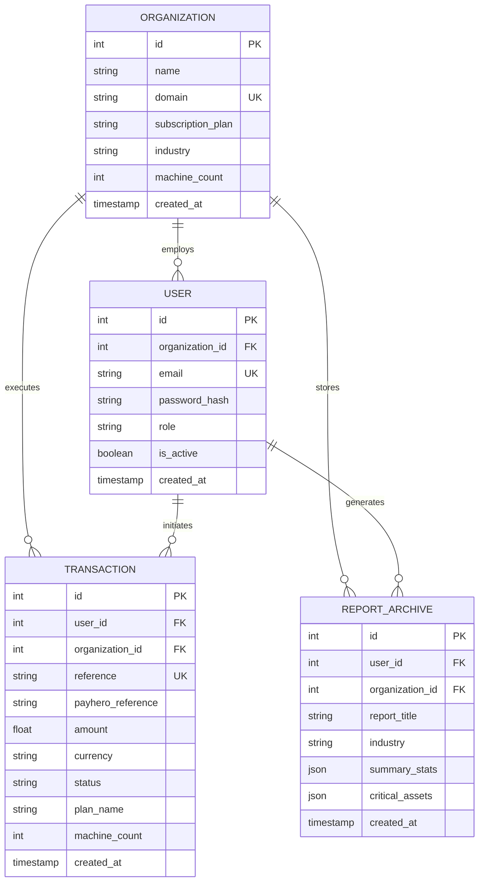

# 🗄️ Database Schema Documentation

This document details the relational data model for the IndustriSense AI platform. The system uses a multi-tenant architecture to ensure secure data isolation between different industrial organizations.

---

## 📐 Entity Relationship Overview

The schema is built around the **Organization** entity, which acts as the primary container for users, fleet data, and financial transactions.

---

## 📑 Table Definitions

### 1. `organizations`
Primary entity for tenant isolation.
- **`domain`**: Unique corporate email domain (e.g., `@factory.com`) used for automated grouping.
- **`subscription_plan`**: Determines feature access (Operational Base, Production Pro, Industrial Nexus).
- **`machine_count`**: The number of assets currently monitored for this tenant.

### 2. `users`
Standard authentication and role-based access control.
- **`role`**: Functional roles (Maintenance Operator, Reliability Engineer, Plant Manager, System Administrator).
- **`organization_id`**: Nullable for independent users, but required for enterprise features.

### 3. `transactions`
Lifecycle tracking for M-Pesa payments via PayHero.
- **`reference`**: Internal unique identifier.
- **`payhero_reference`**: The GUID returned by the PayHero API for status polling.
- **`status`**: Current state (`Pending`, `Completed`, `Failed`).

### 4. `report_archives`
Persistent storage for historical fleet health snapshots.
- **`summary_stats`**: JSON blob containing aggregate health index and failure counts at time of archive.
- **`critical_assets`**: JSON list of machine IDs and their specific risk metrics.

---

## 🔒 Security & Performance
- **Indexing**: B-Tree indexes are applied to all Foreign Keys and Unique constraints.
- **Isolation**: All application-level queries append a mandatory `WHERE organization_id = :id` clause to prevent cross-tenant data leaks.
- **Integrity**: Implements `ON DELETE CASCADE` where appropriate to maintain referential integrity during account offboarding.

---
**Last Updated:** March 2026  
**Engine:** PostgreSQL 15 / SQLAlchemy 2.0
