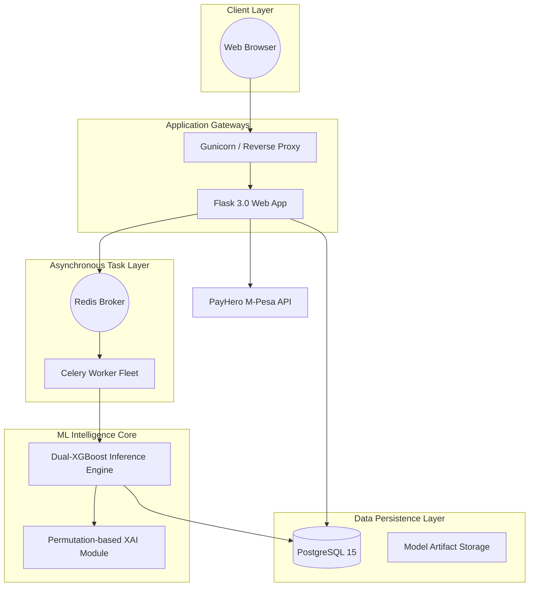
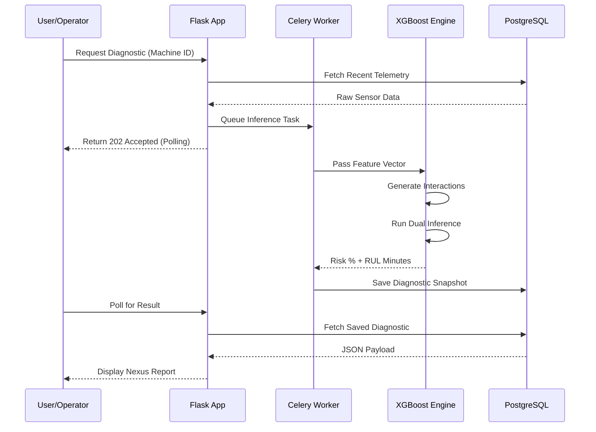

# Software Design Document (SDD): IndustriSense AI

## 1. Introduction

### 1.1 Purpose
This document provides a comprehensive technical design for **IndustriSense AI**, translating the business requirements from the SRS into a system architecture. It defines the structural components, data models, and interface protocols required for implementation and deployment.

### 1.2 Scope
IndustriSense AI is an enterprise-grade predictive maintenance SaaS. This document covers the full-stack design including the Dual-XGBoost ML engine, the multi-tenant PostgreSQL schema, the M-Pesa integration (PayHero), and the Docker-based deployment strategy.

### 1.3 System Overview
The system is designed as a distributed, containerized platform capable of real-time fleet health monitoring and automated failure prognosis.

---

## 2. Architectural Design

### 2.1 High-Level Component Diagram
The platform utilizes a **Distributed Layered Architecture**.

### 2.2 Design Patterns
- **Repository Pattern:** Encapsulation of database queries within SQLAlchemy models.
- **Factory Pattern:** Used in `create_app()` for dynamic environment configuration (Dev/Prod/Test).
- **Asynchronous Task Queue:** Offloading heavy inference to background workers to maintain UI responsiveness.

---

## 3. Data Design

### 3.1 Logical Data Model
The relational schema is optimized for multi-tenancy.

| Table | Primary Role | Key Relations |
|-------|--------------|---------------|
| `organizations` | Tenant isolation | One-to-Many with `users` |
| `users` | Auth & RBAC | Belongs to `organization` |
| `transactions` | Payment lifecycle | Linked to `user_id` |
| `report_archives` | Historical audit | Linked to `organization_id` |

### 3.2 Machine Learning Model Specifications
- **Classifier:** Binary XGBoost (Recall-Optimized). Processes 14 interaction features.
- **Regressor:** XGBoost Regressor (MAE-Optimized). Processes 11 interaction features.
- **Preprocessing:** Standardized Scaler (Joblib) for unit consistency across disparate sensor ranges.

---

## 4. Component Design (Sequence Diagram)

### 4.1 Prediction & Diagnostic Workflow
This diagram illustrates the flow of data during a diagnostic request.

---

## 5. Interface Design

### 5.1 Internal REST API
- **Endpoint:** `POST /api/v1/predict`
  - **Payload:** Raw sensor JSON (AirTemp, ProcessTemp, Speed, Torque).
  - **Logic:** Vectorized interaction generation + model execution.
- **Endpoint:** `GET /api/v1/machine/<id>`
  - **Logic:** Aggregates database state with real-time risk delta.

### 5.2 External Payment Interface (PayHero)
- **Initiation:** REST POST with Basic Auth header.
- **Confirmation:** Webhook (Callback) handler with HMAC verification.

---

## 6. Security Design

### 6.1 Tenant Isolation
- Every database query utilizes a mandatory `WHERE organization_id = ?` clause.
- Global session IDs are tied to the organization domain (e.g., `@work.ac.ke`).

### 6.2 Data Security
- **In-Transit:** Forced TLS 1.3 (via Talisman/Render).
- **At-Rest:** PBKDF2 hashing for credentials; sensitive API keys managed via Render Secrets.

---

## 7. Deployment Design

### 7.1 Infrastructure as Code (Render)
- **Container Registry:** Private Docker Registry.
- **Blueprints:** `render.yaml` orchestrates the managed Postgres, Redis, and the two Docker-based services (Web/Worker).
- **Auto-Scaling:** Horizontal scaling enabled for workers during high-frequency telemetry spikes.

---

## 8. Performance Considerations

- **Vectorization:** ML Service uses NumPy arrays for O(1) interaction calculation regardless of machine count.
- **Database Indexing:** B-Tree indexes on `organization_id` and `created_at` ensure dashboard load times < 200ms.
- **Connection Pooling:** SQLAlchemy `pool_size` optimized for 20 concurrent worker connections.
