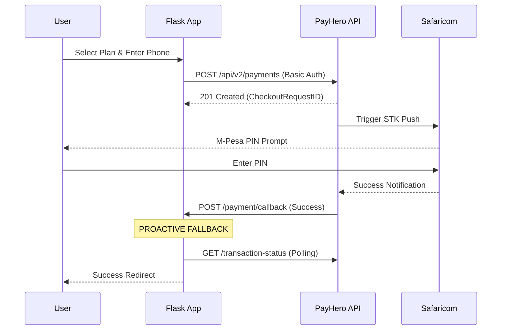

# 💳 PayHero M-Pesa Integration Guide

Documentation for the M-Pesa STK Push integration via PayHero Kenya.

---

## 🏗️ Technical Architecture

The payment system follows a **Proactive Verification** pattern to handle unreliable network callbacks.

---

## 🔧 Configuration

All credentials must be set in `docker-compose.yml` or your production environment:

| Variable | Description | Example |
|----------|-------------|---------|
| `Basic_Auth_Token` | Base64 encoded `Username:Password` | `Basic ajhPQ...` |
| `PAYHERO_CHANNEL_ID` | Your unique M-Pesa Express ID | `5648` |
| `CALLBACK_URL` | Public HTTPS URL for confirms | `https://xxxx.ngrok-free.app/...` |

---

## 📋 Operational Logic

### 1. Initiation
The system cleans the phone number to the local `0...` format (e.g., `0111...`) before sending it to PayHero.

### 2. Dual-Reference Tracking
We store both our internal `external_reference` and PayHero's `reference` (GUID) to ensure status polling is 100% accurate.

### 3. Proactive Polling
If the Ngrok/Production callback is delayed, the frontend automatically triggers a backend check against the PayHero `transaction-status` endpoint every 5 seconds.

---

## 🧪 Testing

### Test Amounts (KES)
- **Operational Base:** 20
- **Production Pro:** 30
- **Industrial Nexus:** 40

### Common Response Codes
- **SUCCESS:** Transaction completed successfully.
- **QUEUED:** Request accepted by Safaricom, awaiting PIN.
- **NOT_FOUND:** Reference is invalid or PayHero hasn't synced it yet.

---

**Last Updated:** March 2026  
**Status:** Validated
